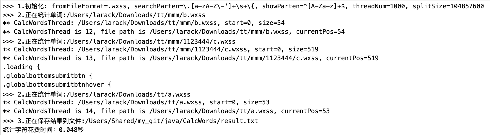

# CalcWords

------

### 1. 简介
CalcWords 是一个java版本的文件内容查找、统计工具

> - [x] 支持操作超大文件，支持分片统计，支持多线程同时统计
> - [x] 支持查找指定目录下的指定格式文件
> - [x] 匹配字符使用正则表达式,显示格式也是正则表达式
> - [x] 支持统计匹配的字符个数
> - [x] 统计结果合并保存,分开保存
> - [x] 丰富的正则表达式

### 2. 使用说明

1. 创建实例

```java
	/**
	 * 构造函数
	 * @param fromFilePath   读取文件路径
	 * @param fromFileFormat 要查的文件格式
	 * @param resultPath     结果保存路径
	 * @param searchParten   搜索正则表达式
	 * @param showParten     显示结果正则表达式
	 * @param threadNum      线程数
	 * @param splitSize      文件分割大小
	 */
	public WordsManager(String fromFilePath, String fromFileFormat, String resultFilePath, String searchParten,
			String showParten, int threadNum, long splitSize)
```

2. 调用方法

```java
	/**
	 * 开始统计并保存结果
	 */
    public void calc()
```

3. 举例

```java
	String fromFilePath = "/Users/Shared/my_git/java/CalcWords/testletters/"; //要读取的文件路径
	String resultFilePath = "/Users/Shared/my_git/java/CalcWords/result.txt";//结果保存路径
    String fromFileFormat = ".wxss";//读取的文件格式
	WordsManager wm = new WordsManager(fromFilePath, fromFileFormat, resultFilePath,
        WordsManager.PARTEN_WXSS_STYLE, WordsManager.PARTEN_LETTER);
	wm.calc();//开始统计
```

4. 输出结果
统计结果除了在 resultFilePath 路径上保存之外，还会在同级别路径上分别保存以_key.txt结尾的key和以_value.txt结尾的value,如:
> /Users/Shared/my_git/java/CalcWords/result.txt_key.txt
> /Users/Shared/my_git/java/CalcWords/result.txt_value.txt



### 3. 扩展用法

1. 更多用法举例

```java
	calcLanguageCh(fromFilePath, resultFilePath);// 统计汉字
	calcLetters(fromFilePath, resultFilePath);// 统计英文单词
	calcWxssStyle(fromFilePath, resultFilePath);// 统计微信小程序源码WWXSS样式
	calcWxssProperty(fromFilePath, resultFilePath);// 统计微信小程序源码WXSS属性
	calcHtml(fromFilePath, resultFilePath);// 统计网页html内容
	calcCellPhone(fromFilePath, resultFilePath);// 统计手机号码
	calcIpAddress(fromFilePath, resultFilePath);// 统计IP地址
	// 更多用法请参照calcBase函数,然后参照PartenUtils.java修正则表达式
```

2. 丰富的正则表达式

```java
	/**
	 * 数字正则（数字开头，数字结尾）
	 */
	public static final String PARTEN_NUM = "[^0-9']+";

	/**
	 * 单词正则（前后空格,加上短横杠）
	 */
	public static final String PARTEN_WORDS = "[^a-zA-Z']+";

	/**
	 * WXSS样式正则
	 */
	public static final String PARTEN_WXSS_STYLE = "\\.[a-zA-Z\\-']+\\s+\\{";

	/**
	 * 匹配中文字符的正则表达式
	 */
	public static final String PARTEN_LANGUAGE_CH = "[\\u4e00-\\u9fa5]";

	/**
	 * 匹配双字节字符(包括汉字在内) 应用：计算字符串的长度（一个双字节字符长度计2，ASCII字符计1）
	 */
	public static final String PARTEN_DOUBLE_BYTE_CHAR = "[^\\x00-\\xff]";

	/**
	 * 匹配空行的正则表达式
	 */
	public static final String PARTEN_NULL_LINE = "\n[\\s| ]*\r";

	/**
	 * 匹配HTML标记的正则表达式
	 */
	public static final String PARTEN_HTML = "/<(.*)>.*<\\/\\1>|<(.*) \\/>/";

	/**
	 * 匹配首尾空格的正则表达式
	 */
	public static final String PARTEN_SPACE_START_END = "(^\\s*)|(\\s*$)";

	/**
	 * 匹配帐号是否合法(字母开头，允许5-16字节，允许字母数字下划线)
	 */
	public static final String PARTEN_ACCOUNT = "^[a-zA-Z][a-zA-Z0-9_]{4,15}$";

	/**
	 * 匹配国内电话号码 正确格式为：“XXXX-XXXXXXX”，“XXXX-XXXXXXXX”，“XXX-XXXXXXX”，
	 */
	public static final String PARTEN_TELEPHONE = "(\\d3,4\\d3,4|\\d{3,4}-|\\s)?\\d{8}";

	/**
	 * 验证身份证号（15位或18位数字）
	 */
	public static final String PARTEN_ID_CARD = "^d{15}|d{}18$";

	/**
	 * 匹配腾讯QQ号
	 */
	public static final String PARTEN_QQ = "^[1-9]*[1-9][0-9]*$";

	public static final String PARTEN_NUM_NOT_NEGATIVE_INT = "^\\d+$";// 非负整数（正整数 + 0）
	
	public static final String PARTEN_NUM_POSITIVE_INT = "^[0-9]*[1-9][0-9]*$"; // 正整数
	
	public static final String PARTEN_NUM_NOT_POSITIVE_INT = "^((-\\d+)|(0+))$"; // 非正整数（负整数 + 0）
	
	public static final String PARTEN_NUM_NEGATIVE_INT = "^-[0-9]*[1-9][0-9]*$"; // 负整数
	
	public static final String PARTEN_NUM_INT = "^-?\\d+$";// 整数
	
	public static final String PARTEN_NUM_NOT_NEGATIVE_FLOAT = "^\\d+(\\.\\d+)?$"; // 非负浮点数（正浮点数 + 0）
	
	public static final String PARTEN_NUM_POSITIVE_FLOAT = "^(([0-9]+\\.[0-9]*[1-9][0-9]*)|([0-9]*[1-9][0-9]*\\.[0-9]+)|([0-9]*[1-9][0-9]*))$"; // 正浮点数
	
	public static final String PARTEN_NUM_NOT_POSITIVE_FLOAT = "^((-\\d+(\\.\\d+)?)|(0+(\\.0+)?))$"; // 非正浮点数（负浮点数 + 0）

	public static final String PARTEN_NUM_NEGATIVE_FLOAT = "^(-(([0-9]+\\.[0-9]*[1-9][0-9]*)|([0-9]*[1-9][0-9]*\\.[0-9]+)|([0-9]*[1-9][0-9]*)))$"; // 负浮点数
	
	public static final String PARTEN_NUM_FLOAT = "^(-?\\d+)(\\.\\d+)?$"; // 浮点数
	
	public static final String PARTEN_LETTER = "^[A-Za-z]+$"; // 由26个英文字母组成的字符串

	public static final String PARTEN_LETTER_UPPER = "^[A-Z]+$"; // 由26个英文字母的大写组成的字符串
	
	public static final String PARTEN_LETTER_LOWER = "^[a-z]+$"; // 由26个英文字母的小写组成的字符串

	public static final String PARTEN_NICKNAME = "^[A-Za-z0-9]+$"; // 由数字和26个英文字母组成的字符串

	public static final String PARTEN_USERNAME = "^\\w+$"; // 由数字、26个英文字母或者下划线组成的字符串

	public static final String PARTEN_EMAIL = "^[\\w-]+(\\.[\\w-]+)*@[\\w-]+(\\.[\\w-]+)+$";// email地址

	public static final String PARTEN_URL = "^[a-zA-z]+://(\\w+(-\\w+)*)(\\.(\\w+(-\\w+)*))*(\\?\\S*)?$";// url

	public static final String PARTEN_Y_M_D = "/^(d{2}|d{4})-((0([1-9]{1}))|(1[1|2]))-(([0-2]([1-9]{1}))|(3[0|1]))$/"; // 年-月-日

	public static final String PARTEN_M_D_Y = "/^((0([1-9]{1}))|(1[1|2]))/(([0-2]([1-9]{1}))|(3[0|1]))/(d{2}|d{4})$/"; // 月/日/年

	public static final String PARTEN_EMAIL_ADDRESS = "^([w-.]+)@(([[0-9]{1,3}.[0-9]{1,3}.[0-9]{1,3}.)|(([w-]+.)+))([a-zA-Z]{2,4}|[0-9]{1,3})(]?)$"; // Emil

	public static final String PARTEN_PHONE = "(d+-)?(d{4}-?d{7}|d{3}-?d{8}|^d{7,8})(-d+)?"; // 电话号码

	public static final String PARTEN_IP_ADDRESS = "^(d{1,2}|1dd|2[0-4]d|25[0-5]).(d{1,2}|1dd|2[0-4]d|25[0-5]).(d{1,2}|1dd|2[0-4]d|25[0-5]).(d{1,2}|1dd|2[0-4]d|25[0-5])$"; // IP地址

```

------

### 3. 关于作者

> * jinqianli 

> * email: [jinqiangood@gmail.com], [larack@126.com]

> * [jinqianli-知乎](https://www.zhihu.com/people/jinqianli/)

> * [jinqianli-cnblog](https://www.cnblogs.com/larack/)

> * jinqianli-官方小程序


> 如果你觉得这篇文章很好，请赞赏作者加个鸡腿吧


2019 年 02月 19日  